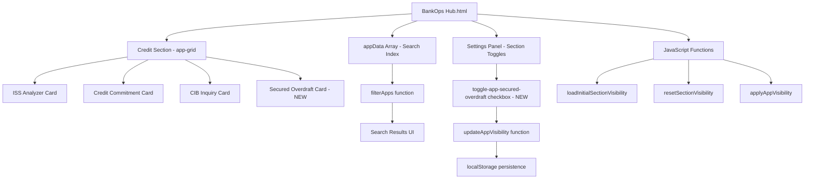

# Design Document: Secured Overdraft Application Form Integration

## Overview

This design describes the integration of the existing Secured Overdraft Application Form Editor into the BankOps Hub dashboard's Credit section. The application already exists as a standalone HTML page at `Secured Overdraft Application Form/Retail Secured Overdraft Application Form.html`. The integration work involves four areas of modification to the single-page `BankOps Hub.html` file:

1. Adding a new app card to the Credit section grid
2. Updating the app count badge from "3 apps" to "4 apps"
3. Registering the app in the `appData` search index array
4. Adding a toggle checkbox to the settings panel's Credit sub-options

No new files are created. All changes are confined to `BankOps Hub.html`.

## Architecture

The BankOps Hub is a single-page HTML application with inline CSS and JavaScript. It uses no build tools, frameworks, or module systems. The architecture is straightforward:



### Key Integration Points

| Integration Point | Location in HTML | Mechanism |
|---|---|---|
| App Card | Inside `#body-credit > .app-grid` | Static HTML element |
| Badge | `Credit` section header `<span>` | Static text change |
| Search Index | `appData` JavaScript array | New object literal |
| Toggle | `#suboptions-credit` div | New checkbox `<label>` |

## Components and Interfaces

### 1. App Card (HTML Element)

A new `<div class="app-card">` element with id `app-secured-overdraft`, placed as the last child of the `.app-grid` within `#body-credit`.

**Structure** (matches existing pattern exactly):
```html
<div class="app-card" id="app-secured-overdraft">
    <i class="app-icon fas fa-file-signature"></i>
    <div class="app-title">Secured Overdraft Application Form</div>
    <div class="app-description">
        Fill and preview print-ready secured overdraft application forms for retail branch processing.
    </div>
    <button class="open-btn" onclick="window.open('Secured Overdraft Application Form/Retail Secured Overdraft Application Form.html', '_blank')">
        <i class="fas fa-external-link-alt"></i>
        Open App
    </button>
</div>
```

**Design Decisions:**
- Icon: `fa-file-signature` — represents a form/document signing action, visually distinct from existing credit icons (`fa-chart-line`, `fa-file-contract`, `fa-search`).
- Description: "Fill and preview print-ready secured overdraft application forms for retail branch processing." (93 characters, within the 150-character limit).
- Placement: After the CIB Inquiry card, making it the 4th and last card in the Credit grid.

### 2. App Count Badge (Text Update)

The existing `<span class="app-count-badge">` inside the Credit section header changes from `3 apps` to `4 apps`.

### 3. Search Index Entry (JavaScript Object)

A new object added to the `appData` array:

```javascript
{
    id: 'app-secured-overdraft',
    title: 'Secured Overdraft Application Form',
    section: 'credit',
    keywords: ['secured', 'overdraft', 'sod', 'loan', 'application', 'form'],
    url: 'Secured Overdraft Application Form/Retail Secured Overdraft Application Form.html',
    icon: 'fa-file-signature'
}
```

This entry integrates with the existing `filterApps()` function which performs case-insensitive partial matching against `title`, `keywords`, and `section` fields.

### 4. Section Toggle Checkbox (HTML Element)

A new `<label>` containing a checkbox input, appended after the CIB Inquiry toggle within `#suboptions-credit`:

```html
<label style="display:flex; align-items:center; padding:10px 14px; cursor:pointer; border-radius:10px; transition:background 0.2s;">
    <input type="checkbox" id="toggle-app-secured-overdraft" class="app-toggle" data-section="credit" onchange="updateAppVisibility()" style="width:18px; height:18px; cursor:pointer; accent-color:#7c3aed;">
    <span style="margin-left:12px; font-size:0.9rem; color:#4b5563; font-weight:500;">Secured Overdraft Application Form</span>
</label>
```

**Integration with existing JavaScript:**
- `updateAppVisibility()` — already iterates all `.app-toggle` checkboxes; no code change needed.
- `loadAppPreferences()` — already reads all `.app-toggle` elements from DOM; defaults to `true` (visible) if no saved preference exists.
- `resetSectionVisibility()` — already sets all `.app-toggle` checkboxes to `checked = true`; no code change needed.
- `applyAppVisibility()` — maps preferences to element display via `document.getElementById(appId)`; will find `app-secured-overdraft` automatically.

## Data Models

### appData Entry Schema

Each entry in the `appData` array conforms to this implicit schema:

| Field | Type | Description |
|---|---|---|
| `id` | `string` | Matches the `id` attribute of the corresponding `.app-card` element |
| `title` | `string` | Display name used in search results |
| `section` | `string` | Section identifier (`cash`, `customer`, `credit`, `misc`) |
| `keywords` | `string[]` | Search keywords for filtering |
| `url` | `string` | Relative path to the app's HTML file |
| `icon` | `string` | Font Awesome icon class (without `fas` prefix) |

### localStorage Schema

**Key:** `bankops_app_visibility`
**Value:** JSON object mapping app IDs (without `toggle-` prefix) to boolean visibility state.

Example after toggle interaction:
```json
{
    "app-iss-analyzer": true,
    "app-credit-commitment": true,
    "app-cib-inquiry": true,
    "app-secured-overdraft": false
}
```

Note: The `updateAppVisibility()` function strips the `toggle-` prefix from checkbox IDs to produce keys like `app-secured-overdraft`, which directly correspond to element IDs in the DOM.

## Correctness Properties

*A property is a characteristic or behavior that should hold true across all valid executions of a system — essentially, a formal statement about what the system should do. Properties serve as the bridge between human-readable specifications and machine-verifiable correctness guarantees.*

### Property 1: Search match correctness

*For any* substring of the Secured Overdraft entry's title, any of its keywords, or the section name "credit" (in any case variation), the `filterApps` function SHALL include the `app-secured-overdraft` entry in the returned matches.

**Validates: Requirements 3.2**

## Error Handling

This integration is purely additive static HTML/JS content. The error surface is minimal:

| Scenario | Handling |
|---|---|
| Target HTML file missing or moved | `window.open` will open a browser tab showing a 404/file-not-found. No in-app error handling needed — consistent with existing apps. |
| localStorage unavailable (private browsing) | Existing `JSON.parse(localStorage.getItem(...)) \|\| {}` pattern gracefully falls back to defaults (visible). No change needed. |
| Corrupted localStorage data | Existing `JSON.parse` calls will throw; the `\|\| {}` fallback handles `null` but not parse errors. This is a pre-existing limitation across all apps, not introduced by this feature. |

## Testing Strategy

### Approach

Since BankOps Hub is a single-page vanilla HTML/JS application with no test framework or build system, testing is primarily manual with optional automated DOM verification.

### Manual Testing Checklist

1. **App Card Rendering** — Verify the Secured Overdraft card appears as the 4th card in the Credit section with correct icon, title, description, and button.
2. **Open App** — Click "Open App" and verify `Retail Secured Overdraft Application Form.html` opens in a new tab.
3. **Badge Count** — Verify the Credit section badge displays "4 apps".
4. **Search by keyword** — Type "sod", "overdraft", "secured", "loan" in search bar and verify the card appears in results.
5. **Search case-insensitivity** — Type "OVERDRAFT" and verify the card appears.
6. **No results** — Type a gibberish string and verify the no-results message appears.
7. **Toggle hide** — Open settings, expand Credit sub-options, uncheck "Secured Overdraft Application Form", verify card disappears from grid.
8. **Toggle show** — Re-check the toggle, verify card reappears.
9. **Persistence** — Hide the card, refresh the page, verify it remains hidden.
10. **Reset** — Click reset in settings, verify checkbox is re-checked and card is visible.
11. **Section toggle** — Uncheck the "Credit" section-level toggle, verify entire section including the new card is hidden.

### Automated Testing (Property-Based)

If a test harness is introduced (e.g., using jsdom + fast-check):

- **Property test for search matching (Property 1):** Generate random substrings from the entry's title/keywords/section with random case transformations. For each generated query, call the filter logic and assert the secured overdraft entry is included in results.
- **Minimum iterations:** 100 per property test.
- **Tag:** `Feature: secured-overdraft-application-form, Property 1: Search match correctness`

### Unit Tests (Example-Based)

| Test | Validates |
|---|---|
| DOM contains `#app-secured-overdraft` with correct child structure | Req 1.1, 1.3 |
| `#app-secured-overdraft` is last child of credit `.app-grid` | Req 1.4 |
| Badge text is "4 apps" | Req 2.1 |
| `appData` contains entry with id `app-secured-overdraft` and correct fields | Req 3.1 |
| Toggle checkbox exists with correct id, class, data-section | Req 5.1 |
| Unchecking toggle hides card and persists to localStorage | Req 4.2 |
| Checking toggle shows card and persists to localStorage | Req 4.3 |
| Load with saved preference `false` results in hidden card | Req 4.4, 5.3 |
| Reset sets toggle to checked and card to visible | Req 5.4 |
| Section-level uncheck hides entire credit section | Req 5.2 |
