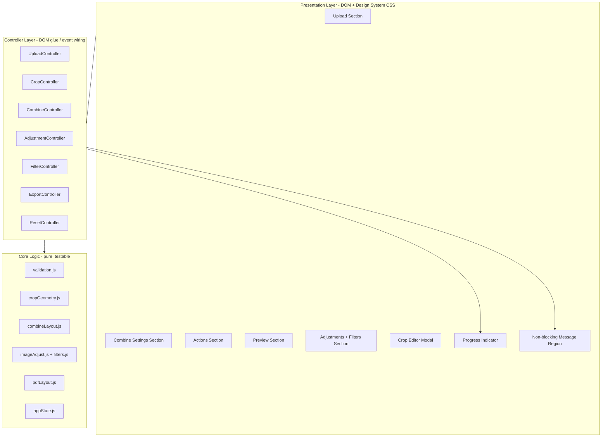
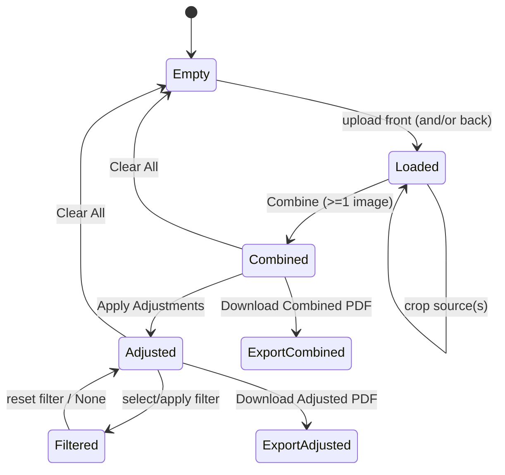

# Design Document

## Overview

NID Stack & Enhance is a single-page, fully client-side browser tool for combining a National ID (NID) front photo and an optional back photo into one stacked, enhanced image and exporting it as an A4 PDF. This redesign keeps the existing technology constraints — plain HTML, CSS, and vanilla JavaScript with locally bundled libraries (jsPDF, html2canvas, pdf.js) and FontAwesome — while delivering three outcomes:

1. **Visual redesign** built on a single, externalized Design System (no inline styles, consistent color/type/spacing tokens, accessible contrast and focus).
2. **Usability and accessibility improvements** — a clear guided flow (Upload → Combine → Adjust/Filter → Export), responsive single-to-multi-column layout, full keyboard operability, screen-reader labeling, and a crop editor that works with mouse, touch, and keyboard.
3. **Defect correction** for the seven known bugs plus the broader robustness requirements (no uncaught errors, state preservation on error).

The redesign reorganizes the current monolithic `script.js` into clearly separated modules (still loaded as plain scripts, no bundler) so that pure logic — validation, geometry, sizing, pixel transforms — is isolated from DOM glue. This separation is what makes the testable correctness properties in this document practical to verify.

### Known Defects Addressed (grounded in current source)

| # | Defect (current behavior) | Source evidence | Requirement |
|---|---------------------------|-----------------|-------------|
| D1 | Browser tab title reads "Image to Combined Image", not the app name | `<title>Image to Combined Image</title>` in HTML head | 1.3 |
| D2 | Drag-and-drop does not update the in-card `preview1/2` image like click does | `setupDropzone` updates `thumb` only; click handler also sets `preview#-container` | 2.3, 12.2, 12.3 |
| D3 | Progress bar sticks at 30% after upload and never completes | upload handlers call `setProgress(30)` and stop | 9.1 |
| D4 | Adjustment sliders raise a blocking `alert()` before a combined image exists | `renderAdjusted` calls `alert('No combined image...')` | 5.3, 5.5 |
| D5 | Filters silently do nothing when no adjusted image exists | `applyFilterToCanvas` returns early when `baseAdjustedCanvas` is empty, no message | 6.4 |
| D6 | PDF margins render the image tiny | `marginBottom=87mm`, `marginLeft/Right=56.2mm` in both PDF handlers | 7.3, 7.4 |
| D7 | Crop editor responds only to mouse events | only `mousedown/mousemove/mouseup` listeners on `cropCanvas` | 3.7, 11.2, 11.6 |

### Scope Decisions

- The current implementation supports a **quadrilateral (perspective) crop**. The requirements (3.3–3.5) describe an axis-aligned rectangular crop with four corner handles, a move interaction, and a minimum 10×10 px size in original pixels. This design standardizes on an **axis-aligned rectangular Crop_Region with four draggable corners**, which satisfies the requirements and simplifies bounds/min-size reasoning. The affine/quad transform path is retained internally only as the rectangle-drawing mechanism (a rectangle is a special quad), so existing draw code can be reused.
- Output width continues to use the maximum natural width of the loaded source images (no user-facing output-width control), matching current behavior.

## Architecture

### High-Level Structure



### Layering Principles

- **Core logic modules are pure**: they take plain data (numbers, typed arrays, geometry objects) and return plain data. They never touch the DOM. This is what the property-based tests target.
- **Controllers** wire DOM events to core logic, manage the `appState`, update canvases/previews, drive the Progress Indicator, and surface messages. They contain no math beyond reading/writing values.
- **Presentation** is entirely CSS-driven via the Design System; markup carries semantic classes and ARIA attributes, never inline `style` attributes.

### Module Responsibilities

| Module | Type | Responsibility |
|--------|------|----------------|
| `appState.js` | state | Single source of truth: source images, crop regions, combine settings, adjustment values, filter selection, derived canvases/flags. Exposes `getState`, `reset`, mutation helpers. |
| `validation.js` | pure | File-type and size validation; spacing validation; range clamping for adjustments. |
| `cropGeometry.js` | pure | Corner-drag constraint, region-move constraint, display↔original coordinate mapping, crop-canvas sizing to viewport. |
| `combineLayout.js` | pure | Compute target width, per-image scaled heights, total canvas height, and per-image destination rectangles given spacing and crops. |
| `imageAdjust.js` | pure | Brightness/contrast/saturation filter-string builder and sharpness convolution kernel; identity guarantee at defaults. |
| `filters.js` | pure | None/Lighten/Document/Grayscale pixel transforms operating on an unfiltered base buffer. |
| `pdfLayout.js` | pure | Compute embedded-image width/height/x/y inside A4 page given margins, preserving aspect ratio. |
| `UploadController` | glue | Click + drag-drop handling, preview/thumbnail rendering, drag highlight, progress, messages. |
| `CropController` | glue | Open/close modal, pointer/touch/keyboard interactions, focus trap, store region. |
| `CombineController` | glue | Read settings, run layout, draw combined canvas, drive progress, enable export. |
| `AdjustmentController` | glue | Slider events (debounced live preview), apply adjustments, guidance when no combined image. |
| `FilterController` | glue | Filter selection/apply/reset against the unfiltered adjusted base, guidance when no adjusted image. |
| `ExportController` | glue | jsPDF availability check, build PDF via `pdfLayout`, save, error handling. |
| `ResetController` | glue | Clear all state and restore default UI. |

### Guided Flow and State Gating



Controls that require a precondition are gated by state flags rather than by raising alerts: when a precondition is missing, the controller shows a **non-blocking message** and makes no state change (Req 5.3, 5.5, 6.4, 4.6, 7.6).

## Components and Interfaces

### Design System

The Design System is defined once in `styles.css` using CSS custom properties (tokens). All inline `style` attributes and the inline `<style>` blocks currently in the HTML are removed and replaced with semantic classes (Req 1.2).

**Token categories:**

- **Color**: `--color-primary`, `--color-primary-dark`, `--color-accent`, `--color-success`, `--color-danger`, surface/background tokens, and text tokens (`--color-text`, `--color-text-muted`). Text/background pairings are chosen to meet WCAG: normal text ≥ 4.5:1 (Req 1.6), large text ≥ 3:1 (Req 1.7), focus ring ≥ 3:1 against adjacent colors (Req 1.5).
- **Typography**: one font stack token, a type scale (`--font-size-xs … --font-size-2xl`), and weight tokens.
- **Spacing**: a fixed scale (`--space-1 … --space-8`) used for all margins/padding/gaps.
- **Radii / shadow / focus**: `--radius-*`, `--shadow-*`, and a single `--focus-ring` definition applied via `:focus-visible`.

A documented constraint for implementation and review: **no color, font-family, or spacing literal may appear outside the token definitions** (Req 1.1), and **no `style=""` attribute may appear in markup** (Req 1.2).

**Five labeled sections** (Req 1.4), each with a visible heading: Upload, Combine Settings, Actions, Preview, Adjustments.

**Focus and contrast** (Req 1.5–1.7, 11.3): a global `:focus-visible` rule renders a visible focus ring on every interactive control; the token is verified to meet 3:1 against both the control and the page background.

### Header (Req 1.3)

`<title>` and the `<h1>` both render the exact string `NID Stack & Enhance`. The page title is set statically in the HTML head (and re-asserted in markup) so the tab and header match case-for-case.

### Message Region (non-blocking) (Req 5.3, 5.5, 6.4, 12.1, 12.4, 9.6)

A single live region replaces all `alert()` calls. It is an ARIA live region (`role="status"` for guidance, `role="alert"` for errors) so messages are announced to assistive technology without stealing focus. Messages support a minimum visible duration (filter guidance ≥ 3 s per Req 6.4). Error messages name the affected file or required image (Req 12.1, 12.4).

```js
// messages.js (glue, thin)
showGuidance(text, { minVisibleMs = 3000 })   // role=status
showError(text)                               // role=alert
clearMessage()
```

### Upload Component (Req 2, 12.2, 12.3)

Two upload cards. Each card contains a hidden file input, a clickable/droppable label, an in-card preview image, a required/optional badge, and a Crop button. A shared `loadSourceImage(file, slot)` routine is used by **both** click and drop paths so the resulting preview, thumbnail, pixel content, dimensions, and slot assignment are identical (fixes D2; Req 12.2, 12.3).

```js
// UploadController
function loadSourceImage(file, slot) {
  // 1. validate(file) -> {ok} | {error}
  // 2. on error: showError(named); leave slot unchanged (Req 2.6-2.8, 12.1)
  // 3. start progress at 0 (Req 9.5)
  // 4. decode via FileReader + Image; on decode failure -> showError + keep slot (Req 2.8, 12.1)
  // 5. on success: set state.sources[slot], render in-card preview AND thumbnail,
  //    clear that slot's crop region, set progress 100 then hide (Req 9.1)
}
```

Drag highlight: `dragover` adds a `.is-dragover` class (visually distinct), `dragleave`/`drop` removes it (Req 2.4).

### Crop Editor Component (Req 3, 10.6, 11.5–11.8)

A modal dialog containing a canvas, an instruction note, and Apply/Cancel buttons. The Crop_Region is an axis-aligned rectangle with four corner handles, stored in **original image pixel coordinates**.

**Input modalities** (fixes D7):
- **Pointer (mouse) and touch** share one set of handlers built on Pointer Events (`pointerdown/move/up`), which cover mouse, touch, and pen uniformly with single-finger drag (Req 3.3, 3.4, 3.7).
- **Keyboard**: handles are focusable; arrow keys move the active corner by 1 px (Shift+arrow by 10 px); a mode toggle allows moving the whole region; all constrained identically (Req 11.2).
- **Escape** closes the dialog discarding changes (Req 3.8, 11.6).

**Focus management**: on open, focus moves into the dialog and is trapped (Req 11.5); on close, focus returns to the Crop button that opened it, or the nearest persistent container if that button is gone (Req 11.7, 11.8).

**Canvas sizing** (Req 10.6): the crop canvas is sized so neither dimension exceeds the current viewport, preserving the source aspect ratio within 1%.

```js
// cropGeometry.js (pure)
sizeCropCanvas(imgW, imgH, viewportW, viewportH) -> { canvasW, canvasH, scale }
constrainCorner(region, cornerIndex, pointer, imgBounds, minPx=10) -> region'
constrainMove(region, delta, imgBounds) -> region'   // size preserved
displayToOriginal(point, scale) -> point
originalToDisplay(point, scale) -> point
```

### Combine Component (Req 4, 9.2, 9.3)

```js
// combineLayout.js (pure)
computeLayout(sources, spacing, bgColor) -> {
  targetWidth,                 // max natural width among included sources
  placements: [{ src, srcRect, dstRect }],  // dstRect stacked front-then-back
  totalHeight                  // sum(heights) + (n-1)*spacing
}
```

`CombineController` validates spacing (Req 4.1, 4.2), defaults background to white (Req 4.3), requires ≥ 1 source (Req 4.6), draws each placement onto `previewCanvas` filling uncovered areas with the background (Req 4.5), updates the Combined Preview replacing the placeholder (Req 4.7), drives a non-decreasing progress 0→100 (Req 9.2, 9.3), and enables the Combined PDF export (Req 4.8).

### Adjustment Component (Req 5)

```js
// imageAdjust.js (pure)
buildFilterString(brightness, contrast, saturation) -> "brightness(..) contrast(..) saturate(..)"
sharpenKernel(amount0to100) -> number[9] | null   // null when amount==0
isIdentity(brightness, contrast, saturation, sharpness) -> boolean  // all 100/100/100/0
```

Live preview of brightness/contrast/saturation updates within 500 ms (Req 5.2) using a debounced canvas redraw. Sharpness convolution runs on Apply. When no Combined_Image exists, slider changes and Apply show non-blocking guidance and change nothing (fixes D4; Req 5.3, 5.5). At default values the adjusted output is pixel-identical to the combined image (Req 5.7). Producing the Adjusted_Image enables the Adjusted PDF export (Req 5.6).

### Filter Component (Req 6)

A persistent **unfiltered adjusted base** buffer (`baseAdjustedCanvas`) is the source for every filter application, so switching filters always applies to the base rather than to an already-filtered image (Req 6.3). Filters: None, Lighten, Document, Grayscale (Req 6.1). Applying/selecting a filter with no Adjusted_Image shows non-blocking guidance visible ≥ 3 s and changes nothing (fixes D5; Req 6.4). Reset and None restore the unfiltered adjusted image (Req 6.5, 6.6).

```js
// filters.js (pure)
applyFilter(name, baseRGBA, width, height) -> RGBA   // never mutates baseRGBA
```

### Export Component (Req 7, 12.4)

```js
// pdfLayout.js (pure)
fitImageToPage(imgW, imgH, page = A4_PORTRAIT, margin) -> { x, y, w, h }
// margin: equal left/right; all four sides > 0 and <= 25.4 mm
```

`ExportController` checks the requested source image exists (Req 7.6, 12.4), checks jsPDF availability (Req 7.7), builds an A4 portrait PDF with the computed fit (fixes D6; Req 7.1–7.4), triggers the save dialog (Req 7.5), and reports failures without altering state (Req 7.8, 12.5).

**Margin decision**: use a uniform 12.7 mm (0.5 in) margin on all four sides. This satisfies Req 7.4 (all sides > 0 and ≤ 25.4 mm; left == right) and yields a large printable area (≈184.6 mm × 271.6 mm) so the image renders at a sensible size, directly replacing the oversized 56.2/87 mm margins of D6.

### Progress Indicator (Req 9)

A thin controller wraps the progress element: `begin()` shows it at 0% (Req 9.5); `set(p)` enforces a non-decreasing value within an operation (Req 9.2); `complete()` sets 100% and hides within 1 s (Req 9.1, 9.3, 9.4); `fail()` hides within 1 s and surfaces a "did not complete" message (Req 9.6). Uploads now drive `complete()` on decode success (fixes D3).

### Responsive Layout (Req 10)

CSS Grid/Flex with a 600 px breakpoint: single full-width column at ≤ 600 px (Req 10.1), two-or-more columns above (Req 10.2). No horizontal scroll at ≥ 320 px (Req 10.3). Touch targets ≥ 44×44 px at ≤ 600 px (Req 10.4). Layout reflows on resize/orientation via CSS media queries without reload (Req 10.5).

## Data Models

```js
// Crop_Region — axis-aligned, ORIGINAL image pixel coordinates
CropRegion = { x: int, y: int, w: int, h: int }   // w >= 10, h >= 10, within image bounds

// Source slot
SourceSlot = {
  image: HTMLImageElement | null,
  naturalWidth: int,
  naturalHeight: int,
  crop: CropRegion | null         // null => full-image bounds
}

// Combine settings
CombineSettings = {
  spacing: int,                   // 0..500 inclusive, whole number
  backgroundColor: string         // hex, default "#ffffff"
}

// Adjustment values
Adjustments = {
  brightness: int,                // 0..200, default 100
  contrast:   int,                // 0..200, default 100
  saturation: int,                // 0..200, default 100
  sharpness:  int                 // 0..100, default 0
}

FilterName = "none" | "lighten" | "document" | "grayscale"   // default "none"

// Application state (appState.js)
AppState = {
  sources: { front: SourceSlot, back: SourceSlot },
  settings: CombineSettings,
  adjustments: Adjustments,
  filter: FilterName,
  combinedImage: ImageBitmapLike | null,   // backs previewCanvas
  adjustedBase:  ImageBitmapLike | null,   // unfiltered adjusted result
  adjustedImage: ImageBitmapLike | null    // adjusted + current filter
}

// Layout result (combineLayout.js)
Placement = { src: SourceSlot, srcRect: Rect, dstRect: Rect }
Layout = { targetWidth: int, totalHeight: int, placements: Placement[] }

// PDF fit (pdfLayout.js)
A4_PORTRAIT = { widthMm: 210, heightMm: 297 }
PdfFit = { x: number, y: number, w: number, h: number }  // mm

// Validation result
ValidationResult = { ok: true } | { ok: false, reason: "type" | "size" | "decode", message: string }
SUPPORTED_TYPES = ["image/jpeg", "image/png", "image/webp", "image/gif"]
MAX_FILE_BYTES = 10 * 1024 * 1024
```

### Default State (Req 8.4)

`reset()` returns state to: no sources, no crops, no combined/adjusted images; spacing 10, background `#ffffff`, brightness/contrast/saturation 100, sharpness 0, filter `none`; both PDF export controls hidden; progress hidden at no partial value (Req 8.1–8.5).

## Correctness Properties

*A property is a characteristic or behavior that should hold true across all valid executions of a system — essentially, a formal statement about what the system should do. Properties serve as the bridge between human-readable specifications and machine-verifiable correctness guarantees.*

Although the application is delivered as a browser tool, its core logic is factored into pure modules (validation, geometry, layout, pixel transforms, sizing, state reset) that take plain data and return plain data. Those modules are where property-based testing applies. UI rendering, focus management, responsive CSS, contrast tokens, and external-library wiring are validated by example, edge-case, and smoke tests in the Testing Strategy instead.

The following properties were derived from the prework analysis and consolidated to remove redundancy.

### Property 1: Load-path equivalence

*For any* supported image file, loading it into a given slot via the drag-and-drop path produces the same resulting slot state — preview pixel content, thumbnail pixel content, image dimensions, and slot assignment — as loading the same file into the same slot via the click path.

**Validates: Requirements 2.3, 12.2, 12.3**

### Property 2: File validation

*For any* file, validation accepts it if and only if its type is one of JPEG, PNG, WebP, or GIF **and** its size is at most 10 MB; otherwise validation rejects it with reason `type` when the type is unsupported and reason `size` when a supported-type file exceeds 10 MB.

**Validates: Requirements 2.6, 2.7**

### Property 3: Spacing validation

*For any* candidate spacing value, spacing validation accepts it if and only if it is a whole number in the range 0 to 500 inclusive; for any rejected value the previously accepted Spacing_Value is returned unchanged.

**Validates: Requirements 4.1, 4.2**

### Property 4: Crop corner constraint

*For any* Crop_Region, any corner index, any pointer position, and any image bounds, moving that corner produces a region whose four corners all lie within the image bounds and whose width and height are each at least 10 pixels in original image coordinates.

**Validates: Requirements 3.3**

### Property 5: Crop region move preserves size

*For any* Crop_Region and any move delta, moving the entire region produces a region with all four corners within the image bounds and with width and height identical to the original region's width and height.

**Validates: Requirements 3.4**

### Property 6: Crop coordinate round trip

*For any* point within the crop canvas and any draw scale, converting display coordinates to original image coordinates and back yields the original point within a one-pixel rounding tolerance, and the stored Crop_Region is expressed in original image pixel coordinates.

**Validates: Requirements 3.5**

### Property 7: Crop initial region equals full bounds

*For any* image dimensions, opening the Crop_Editor for a source with no previously stored region initializes the Crop_Region to the full image bounds (x=0, y=0, width=imageWidth, height=imageHeight).

**Validates: Requirements 3.1**

### Property 8: Combine layout integrity

*For any* set of loaded sources (front only, back only, or both), any stored crops, and any valid spacing, the computed layout (a) includes exactly the loaded sources in front-then-back order, (b) gives every placement a destination width equal to the target width, (c) inserts a vertical gap equal to the spacing between adjacent placements, and (d) has a total height equal to the sum of the placement heights plus (n − 1) × spacing.

**Validates: Requirements 4.4, 4.5**

### Property 9: Adjustment identity at defaults

*For any* combined image pixel buffer, applying adjustments with brightness, contrast, and saturation each at 100 percent and sharpness at 0 produces an Adjusted_Image whose pixel values are identical to the combined image.

**Validates: Requirements 5.7**

### Property 10: Filter base-application

*For any* unfiltered adjusted base buffer and any sequence of filter selections, the displayed Adjusted_Image equals applying only the most recently selected filter directly to the unfiltered base (filters never compound); selecting None and resetting the filter both yield pixels identical to the base.

**Validates: Requirements 6.3, 6.5, 6.6**

### Property 11: PDF fit and margins

*For any* image dimensions, the embedded-image placement computed for an A4 portrait page (a) preserves the original width-to-height ratio within a deviation of no more than 1 percent, (b) fits entirely within the printable area, (c) has equal left and right margins, and (d) has top, bottom, left, and right margins that are each greater than 0 mm and no greater than 25.4 mm.

**Validates: Requirements 7.3, 7.4**

### Property 12: Progress monotonicity

*For any* sequence of progress updates issued within a single operation, the displayed progress value is non-decreasing and always lies between 0 and 100 inclusive.

**Validates: Requirements 9.2**

### Property 13: Crop canvas sizing

*For any* source image dimensions and any viewport dimensions, the crop canvas size has neither width nor height exceeding the corresponding viewport dimension, while preserving the source image aspect ratio within a tolerance of 1 percent.

**Validates: Requirements 10.6**

### Property 14: Reset to defaults

*For any* prior application state, performing a clear/reset yields a state with no source images, no stored crop regions, no combined image, and no adjusted image, and with spacing = 10, background = white (#ffffff), brightness = contrast = saturation = 100, sharpness = 0, and filter = None.

**Validates: Requirements 8.1, 8.4**

### Property 15: State preservation on reported error

*For any* application state and any operation that reports an error to the User (unsupported/oversized/undecodable file, invalid spacing, export with a missing source, or a failed PDF generation), the application state after the error — all previously produced images and all current settings — is identical to the state before the operation.

**Validates: Requirements 12.5**

## Error Handling

All user-facing errors and guidance flow through the single non-blocking message region (`role="alert"` for errors, `role="status"` for guidance). No code path uses `alert()`, `confirm()`, or `prompt()` — this directly removes the blocking dialogs of defects D4 and D5.

| Condition | Handling | Requirement |
|-----------|----------|-------------|
| Unsupported file type | `validation.js` returns `{reason:"type"}`; controller shows named error, leaves slot unchanged | 2.6, 12.1 |
| File > 10 MB | `validation.js` returns `{reason:"size"}`; named error, slot unchanged | 2.7 |
| Undecodable file | `Image.onerror` path → named error within 2 s, slot/preview/thumbnail retained | 2.8, 12.1 |
| Crop on empty slot | Guard before open; modal stays closed, guidance shown | 3.2 |
| Invalid spacing | `validateSpacing` rejects; previous value retained, range message shown | 4.2 |
| Combine with no source | Guard; no combined image, "at least one image" message | 4.6 |
| Adjust/filter with missing precondition | Non-blocking guidance (filter guidance ≥ 3 s), no state change | 5.3, 5.5, 6.4 |
| Export with missing source image | Named message identifying required image; no PDF created | 7.6, 12.4 |
| jsPDF unavailable | "PDF export currently unavailable" message; state unchanged | 7.7 |
| PDF generation throws after load | "export failed" message; state unchanged | 7.8 |
| Operation fails mid-progress | Progress hidden within 1 s; "did not complete" message | 9.6 |
| Any reported error | State (images + settings) preserved unchanged (Property 15) | 12.5 |

**Global robustness**: each controller wraps its event handlers in try/catch that route to `showError` and `progress.fail()` rather than letting exceptions escape, so the upload/crop/combine/adjust/filter/export workflows complete with zero uncaught console/runtime errors (Req 12.6). The coordinate, layout, validation, and sizing functions are total (defined for all inputs) and clamp rather than throw.

## Testing Strategy

### Dual Approach

- **Property-based tests** verify the 15 universal properties above against the pure core modules across many generated inputs.
- **Unit / example tests** verify concrete behaviors, DOM wiring, and edge cases (titles, labels, control presence, guards, focus management, save invocation).
- **Smoke / static checks** verify one-time configuration and governance constraints.

### Tooling

- **Test runner**: Vitest (jsdom environment) — runs in Node, no browser build step, integrates with the existing no-bundler setup by importing the pure modules directly.
- **Property-based library**: **fast-check** (the standard PBT library for JavaScript). Property tests must not reimplement generation by hand.
- The pure modules (`validation.js`, `cropGeometry.js`, `combineLayout.js`, `imageAdjust.js`, `filters.js`, `pdfLayout.js`, `appState.js`) are written as ES modules importable by tests; controllers remain thin DOM glue exercised by example tests with jsdom.

### Property Test Requirements

- Each property test runs a **minimum of 100 iterations** (`fc.assert(..., { numRuns: 100 })` or higher).
- Each property test is tagged with a comment referencing its design property in the format:
  `// Feature: nid-stack-enhance-redesign, Property {number}: {property_text}`
- Each of Properties 1–15 maps to exactly **one** property-based test.
- Generators: arbitrary file descriptors (type ∈ supported∪unsupported, size around the 10 MB boundary) for P2; arbitrary integers including out-of-range/non-integer for P3; arbitrary rectangles, corner indices, pointer points, and image bounds for P4–P7, P13; arbitrary source-set/crop/spacing combinations for P8; arbitrary small RGBA buffers for P9, P10; arbitrary image dimensions for P11; arbitrary update sequences for P12; arbitrary prior-state objects for P14, P15.

### Property → Test Mapping

| Property | Module under test | Key generators |
|----------|-------------------|----------------|
| P1 Load-path equivalence | UploadController load routine (shared) | supported image fixtures |
| P2 File validation | `validation.validateFile` | type + size |
| P3 Spacing validation | `validation.validateSpacing` | numbers incl. non-integer/out-of-range |
| P4 Corner constraint | `cropGeometry.constrainCorner` | region, corner, pointer, bounds |
| P5 Region move | `cropGeometry.constrainMove` | region, delta, bounds |
| P6 Coordinate round trip | `cropGeometry.display/originalTo*` | point, scale |
| P7 Initial region | `cropGeometry.initialRegion` | image dims |
| P8 Combine layout | `combineLayout.computeLayout` | sources, crops, spacing |
| P9 Adjustment identity | `imageAdjust.adjust` | RGBA buffer |
| P10 Filter base-application | `filters.applyFilter` + base model | base buffer, filter seq |
| P11 PDF fit | `pdfLayout.fitImageToPage` | image dims |
| P12 Progress monotonicity | progress controller model | update sequence |
| P13 Crop canvas sizing | `cropGeometry.sizeCropCanvas` | image + viewport dims |
| P14 Reset to defaults | `appState.reset` | arbitrary prior state |
| P15 State preservation on error | `appState` + operation wrappers | prior state + error op |

### Example / Edge-Case Tests

- Header title equals header text equals `NID Stack & Enhance` (1.3); five labeled sections (1.4); required/optional labels (2.9); four filter options (6.1); control presence/ranges (5.1).
- Guards and non-blocking behavior: crop-on-empty (3.2), combine-no-source (4.6), adjust/filter guidance with no precondition and assertion that `alert` is never called (5.3, 5.5, 6.4), export missing source (7.6, 12.4), jsPDF unavailable (7.7), generation failure (7.8).
- Crop cancel/Escape preserve stored region (3.6, 3.8); touch routing through shared constraints (3.7); decode-failure message names file (12.1).
- Focus management: focus enters/traps in crop dialog (11.5), Escape closes (11.6), focus returns to opener (11.7) and to nearest parent when opener removed — edge case (11.8); accessible names on all controls and icon-only controls (11.1, 11.9); focus order (11.4); visible focus on focus (11.3).
- Progress lifecycle timing: begin at 0% visible (9.5), reach 100% then hide within 1 s for upload and combine (9.1, 9.3, 9.4), fail hides within 1 s with message (9.6).
- Export produces a single A4 portrait page and invokes save (7.1, 7.2, 7.5); adjusted/combined export controls enable on production (4.8, 5.6); sharpness changes output (5.4).
- Responsive: single column at ≤ 600 px (10.1), multi-column above (10.2), no horizontal scroll at 320 px (10.3), 44×44 touch targets (10.4), reflow on resize (10.5).

### Smoke / Static Checks

- No inline `style` attributes and no inline `<style>` blocks in markup (1.2); all color/font/spacing literals resolve to Design System tokens (1.1).
- Contrast assertions over the fixed token palette: focus ring ≥ 3:1 (1.5), normal text ≥ 4.5:1 (1.6), large text ≥ 3:1 (1.7).
- End-to-end workflow smoke run asserting zero uncaught errors across upload → crop → combine → adjust → filter → export (8.5, 12.6).
