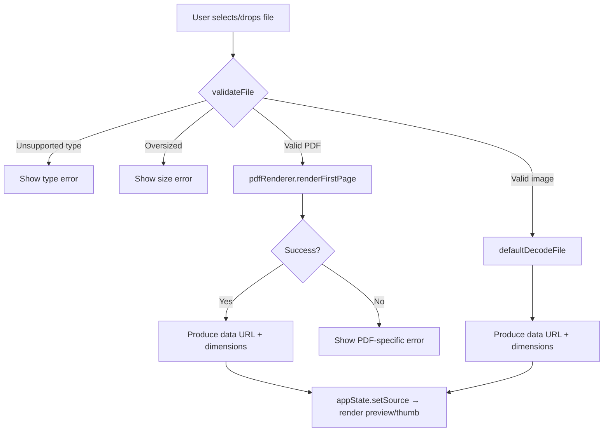
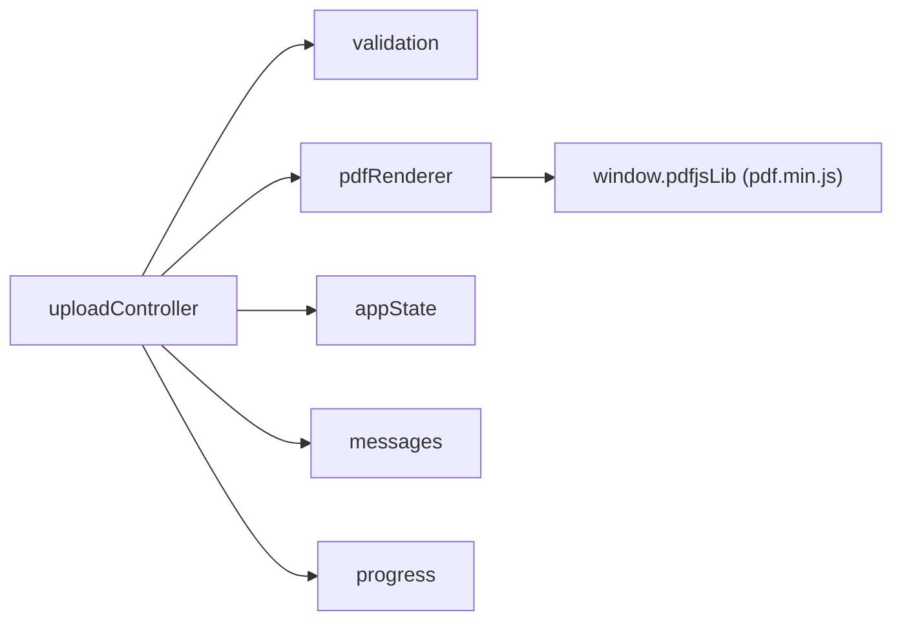

# Design Document: PDF Upload Support

## Overview

This design extends the NID Stack & Enhance application to accept PDF files alongside the existing image formats. When a user uploads a PDF (via click or drag-and-drop) to either the front or back NID slot, the system renders the first page of the PDF as a high-resolution PNG image using the bundled pdf.js library (Mozilla, 2023 build at `libs/pdf.min.js`). The resulting image feeds seamlessly into the existing crop → combine → adjust → filter → export pipeline.

The design follows the application's established patterns:
- A new **pure core module** (`src/core/pdfRenderer.js`) handles PDF-to-image conversion with no DOM dependencies beyond an offscreen canvas.
- The existing **validation module** is extended to accept `application/pdf`.
- The existing **uploadController** gains a PDF-detection branch that delegates to the PDF renderer before committing the result to appState via the same `loadSourceImage` flow used for images.

Key constraints: the application runs fully offline from the filesystem, uses esbuild for bundling, and pdf.js is loaded as a global script (`pdfjsLib` on `window`).

## Architecture



The PDF rendering path runs parallel to the existing image decode path. Both converge at the same state-mutation and UI-render step, guaranteeing identical downstream behavior regardless of source file type.

### Dependency Flow



## Components and Interfaces

### 1. Validation Module Extension (`src/core/validation.js`)

**Change:** Add `"application/pdf"` to the `SUPPORTED_TYPES` array. Update the rejection message to list PDF among supported formats.

```javascript
export const SUPPORTED_TYPES = Object.freeze([
  "image/jpeg",
  "image/png",
  "image/webp",
  "image/gif",
  "application/pdf",
]);
```

No other changes to validation logic — the existing `validateFile` function checks type membership then size, which naturally extends to PDFs.

### 2. PDF Renderer Module (`src/core/pdfRenderer.js`)

A new **pure-logic module** responsible for converting a PDF file's first page into an image. It has no DOM event listeners and no side effects beyond creating an offscreen canvas.

**Exported Interface:**

```javascript
/**
 * @typedef {Object} PdfRenderResult
 * @property {true} ok
 * @property {string} dataUrl - PNG data URL ("data:image/png;base64,...")
 * @property {number} naturalWidth - Positive integer pixel width
 * @property {number} naturalHeight - Positive integer pixel height
 */

/**
 * @typedef {Object} PdfRenderError
 * @property {false} ok
 * @property {'load'|'no-pages'|'render'} reason
 * @property {string} message - Human-readable error description
 */

/**
 * Render the first page of a PDF file as a PNG image.
 *
 * @param {ArrayBuffer} arrayBuffer - The PDF file content
 * @param {Object} [options]
 * @param {number} [options.minScale=2.0] - Minimum scale factor
 * @param {number} [options.maxDimension=4096] - Maximum pixel dimension
 * @param {Function} [options.getDocument] - pdf.js getDocument (for testing)
 * @returns {Promise<PdfRenderResult|PdfRenderError>}
 */
export async function renderFirstPage(arrayBuffer, options = {}) { ... }
```

**Internal Algorithm:**

1. Call `pdfjsLib.getDocument({ data: arrayBuffer }).promise`
2. If loading fails → return `{ ok: false, reason: 'load', message: ... }`
3. If `pdfDocument.numPages === 0` → return `{ ok: false, reason: 'no-pages', message: ... }`
4. Call `pdfDocument.getPage(1)` (always page 1, never subsequent pages)
5. Get page viewport at scale 1.0, compute effective scale as `Math.max(minScale, viewport.scale)`
6. Compute canvas dimensions from scaled viewport
7. If either dimension > `maxDimension`, scale down proportionally
8. Create offscreen canvas, get 2D context, call `page.render({ canvasContext, viewport: scaledViewport })`
9. If render fails → return `{ ok: false, reason: 'render', message: ... }`
10. Convert canvas to PNG data URL via `canvas.toDataURL('image/png')`
11. Return `{ ok: true, dataUrl, naturalWidth, naturalHeight }`

**Design Decisions:**
- The module accepts an `ArrayBuffer` rather than a `File` object so the controller handles `FileReader` concerns (consistent with existing decode patterns).
- `getDocument` is injectable for testing (avoids needing the actual pdf.js library in unit tests).
- The `maxDimension` cap (4096px) prevents memory issues on mobile browsers where canvas sizes are limited.
- Scale selection ensures the output is always at least 150 DPI equivalent (scale ≥ 2.0 on typical 72 DPI PDF pages).

### 3. Upload Controller Extension (`src/controllers/uploadController.js`)

**Changes to `loadSourceImage`:**

After validation passes and before decoding, detect PDF type:

```javascript
const isPdf = file.type === 'application/pdf';
```

If PDF:
1. Read file as `ArrayBuffer` (via `FileReader.readAsArrayBuffer`)
2. Call `pdfRenderer.renderFirstPage(arrayBuffer)`
3. On success: create an `Image` element from the returned data URL, wait for `onload`, then continue with the existing state-mutation path
4. On error: route the specific error reason to `messages.showError()` and call `progress.fail()`

If not PDF: proceed with existing `decodeFile(file)` path (no change).

**Accept attribute update in `init()`:**

```javascript
function wireSlot(cfg) {
  const input = byId(cfg.fileInput);
  // Set accept attribute to include PDF
  if (input) {
    input.setAttribute('accept',
      'image/jpeg,image/png,image/webp,image/gif,application/pdf');
  }
  // ... existing event wiring
}
```

**Progress during PDF rendering:**

- `progress.begin()` — called immediately after validation (0%)
- `progress.set(50)` — called after PDF document loads successfully (midpoint feedback)
- `progress.complete()` — called after image is fully rendered and committed

This ensures progress is non-decreasing and the user sees activity during the longer PDF render operation.

### 4. File Reading Helper

A new internal helper `readFileAsArrayBuffer(file)` returns a Promise<ArrayBuffer>:

```javascript
function readFileAsArrayBuffer(file) {
  return new Promise((resolve, reject) => {
    const reader = new FileReader();
    reader.onload = (e) => resolve(e.target.result);
    reader.onerror = () => reject(new Error('read-failed'));
    reader.readAsArrayBuffer(file);
  });
}
```

This is placed inside `uploadController.js` (or can be extracted to a utility) and mirrors the existing `defaultDecodeFile` pattern.

## Data Models

### PdfRenderResult

| Field | Type | Description |
|-------|------|-------------|
| `ok` | `true` | Indicates successful rendering |
| `dataUrl` | `string` | PNG data URL starting with `"data:image/png;base64,"` |
| `naturalWidth` | `number` | Positive integer, pixel width of rendered image (≤ 4096) |
| `naturalHeight` | `number` | Positive integer, pixel height of rendered image (≤ 4096) |

### PdfRenderError

| Field | Type | Description |
|-------|------|-------------|
| `ok` | `false` | Indicates failure |
| `reason` | `'load' \| 'no-pages' \| 'render'` | Category of failure |
| `message` | `string` | Human-readable message for the ARIA live region |

### AppState Source Slot (unchanged structure)

The rendered PDF image is stored identically to a directly-uploaded image:

```javascript
{
  image: HTMLImageElement,      // decoded from the PNG data URL
  naturalWidth: number,         // from PdfRenderResult
  naturalHeight: number,        // from PdfRenderResult
  crop: null                    // cleared on new upload
}
```

No additional PDF-specific metadata (page count, etc.) is stored.

## Correctness Properties

*A property is a characteristic or behavior that should hold true across all valid executions of a system — essentially, a formal statement about what the system should do. Properties serve as the bridge between human-readable specifications and machine-verifiable correctness guarantees.*

### Property 1: PDF File Validation

*For any* file object, `validateFile` SHALL accept it if and only if its `type` is one of the supported MIME types (including `"application/pdf"`) AND its `size` is at most 10 MB. Type is checked before size: an unsupported type is always rejected with reason `"type"` regardless of size, and a supported-type file exceeding 10 MB is rejected with reason `"size"`.

**Validates: Requirements 1.2, 1.3, 1.4**

### Property 2: Scale Factor Lower Bound

*For any* PDF page viewport with any default scale value, the effective rendering scale chosen by `renderFirstPage` SHALL be at least 2.0 and at least the page's own default viewport scale, whichever is larger.

**Validates: Requirements 3.3**

### Property 3: Output Dimension Bounds and Aspect Ratio Preservation

*For any* PDF page viewport (of any width and height), the rendered output dimensions SHALL be positive integers, neither dimension SHALL exceed 4096 pixels, and the aspect ratio of the output SHALL equal the aspect ratio of the scaled viewport (within floating-point tolerance).

**Validates: Requirements 3.5, 3.6**

### Property 4: Progress Monotonicity

*For any* PDF upload operation (successful or failed), the sequence of progress percentage values reported during that operation SHALL be non-decreasing — no value is ever less than a previously reported value within the same operation.

**Validates: Requirements 4.2**

### Property 5: State Preservation on Error

*For any* initial application state and any PDF processing error (load failure, zero pages, render failure), the application state after the error SHALL be identical to the state before the operation was attempted — no preview, thumbnail, or source-slot mutation occurs.

**Validates: Requirements 5.4**

### Property 6: Path Equivalence and Consistent State Mutation

*For any* valid PDF file, processing it via the click path SHALL produce identical application state (source slot image, naturalWidth, naturalHeight, crop: null) as processing the same file via the drag-and-drop path. In both cases, the crop for that slot SHALL be null after a successful upload.

**Validates: Requirements 6.1, 6.4, 6.5**

### Property 7: First-Page-Only Equivalence

*For any* PDF document with N ≥ 1 pages, the rendered output (data URL, naturalWidth, naturalHeight) and resulting application state SHALL be identical to that produced from a single-page PDF whose only page is identical to the original document's first page. No page count or per-page metadata for pages beyond page 1 SHALL be stored.

**Validates: Requirements 7.1, 7.2, 7.3**

## Error Handling

### Error Categories

| Error Condition | Detection Point | User Message | State Impact |
|----------------|----------------|--------------|--------------|
| Unsupported MIME type | `validateFile()` | "File is not a supported format. Supported: JPEG, PNG, WebP, GIF, PDF." | No state change, no progress shown |
| File too large (>10 MB) | `validateFile()` | "File exceeds the maximum allowed size of 10 MB." | No state change, no progress shown |
| FileReader failure | `readFileAsArrayBuffer()` | "The PDF \"[filename]\" could not be loaded." | Slot unchanged, progress hidden |
| pdf.js load failure | `pdfjsLib.getDocument()` | "The PDF \"[filename]\" could not be loaded. The file may be corrupted or encrypted." | Slot unchanged, progress hidden |
| Zero pages | `pdfDocument.numPages === 0` | "The PDF \"[filename]\" has no renderable pages." | Slot unchanged, progress hidden |
| Render failure | `page.render()` rejection | "The PDF page in \"[filename]\" could not be rendered." | Slot unchanged, progress hidden |
| Data URL conversion failure | `canvas.toDataURL()` | "The PDF page in \"[filename]\" could not be rendered." | Slot unchanged, progress hidden |

### Error Flow Design

1. **Validation errors** (type/size) are caught *before* progress.begin() — the user never sees the progress bar flicker for an invalid file.
2. **Processing errors** (load/render) are caught *after* progress.begin() — the progress bar is visible, then `progress.fail()` hides it within 1000ms while showing the error message.
3. All errors route through the existing `messages.showError()` → ARIA live region pattern.
4. The `loadSourceImage` function returns `{ ok: false, slot, reason }` on any error, allowing callers to react if needed.

### Defensive Coding

- The `pdfRenderer` module wraps all pdf.js calls in try/catch to distinguish load errors from render errors.
- The upload controller wraps the entire PDF path in the existing `safeLoad` error boundary so unexpected exceptions never propagate as uncaught errors.
- Canvas creation uses `document.createElement('canvas')` (or injected factory) to avoid issues in environments without OffscreenCanvas support.

## Testing Strategy

### Property-Based Tests (fast-check, minimum 100 iterations each)

The following properties are tested using the `fast-check` library, consistent with the project's existing property-based testing approach:

| Property | Module Under Test | Generator Strategy |
|----------|------------------|--------------------|
| Property 1: PDF File Validation | `validation.js` | Random MIME types × random sizes (boundary-inclusive) |
| Property 2: Scale Factor Lower Bound | `pdfRenderer.js` | Random viewport scales (0.1–10.0) |
| Property 3: Dimension Bounds | `pdfRenderer.js` | Random viewport dimensions (1–20000 px) |
| Property 4: Progress Monotonicity | `uploadController.js` | Random PDF files triggering various progress paths |
| Property 5: State Preservation | `uploadController.js` | Random initial states × error conditions |
| Property 6: Path Equivalence | `uploadController.js` | Random PDF files via both click and drop |
| Property 7: First-Page Equivalence | `pdfRenderer.js` | Mock PDFs with varying page counts (1–50) |

Each property test is tagged:
```
// Feature: pdf-upload-support, Property N: [property text]
```

### Example-Based Unit Tests

| Scenario | Verification |
|----------|--------------|
| Accept attribute includes PDF after init() | DOM assertion |
| PDF drop triggers same routine as click | Mock call verification |
| Successful PDF render updates preview/thumb | DOM src assertions |
| Load error shows distinct message from render error | Message text assertions |
| Zero-page PDF shows specific error | Message text assertion |
| Multi-page PDF only calls getPage(1) | Mock call count |

### Integration Considerations

- pdf.js is loaded as a global script, so property tests mock `pdfjsLib.getDocument` rather than importing the library.
- The `renderFirstPage` function accepts an injectable `getDocument` option specifically to enable isolated testing without the 500KB+ pdf.js bundle.
- Canvas operations are mocked in the test environment (jsdom) since jsdom doesn't implement canvas natively.

### Test File Naming Convention (following project patterns)

- `tests/validation.pdfFile.property.test.js` — Property 1
- `tests/pdfRenderer.scale.property.test.js` — Property 2
- `tests/pdfRenderer.dimensions.property.test.js` — Property 3
- `tests/uploadController.pdfProgress.property.test.js` — Property 4
- `tests/uploadController.pdfStatePreservation.property.test.js` — Property 5
- `tests/uploadController.pdfPathEquivalence.property.test.js` — Property 6
- `tests/pdfRenderer.firstPageOnly.property.test.js` — Property 7
